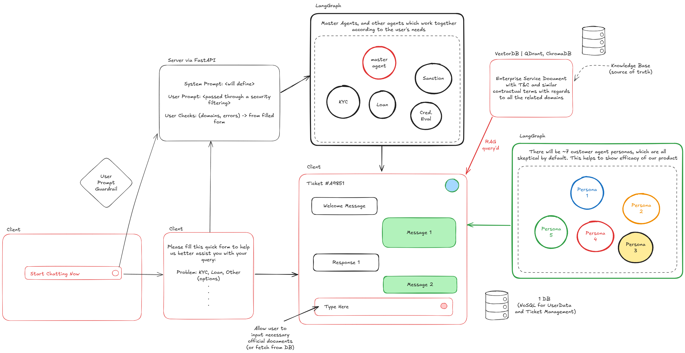

# PRISM - AI Loan Assistant

**Persuasive Response & Instant Sanction Machine**

## 📋 Overview

PRISM is an AI-powered conversational loan sales assistant designed to improve conversion rates for customers. Built to address the challenge of impersonal and inefficient traditional lead generation, PRISM leverages Agentic AI to simulate human-like sales discussions, verify KYC, evaluate credit-worthiness, and issue instant loan sanction letters.

## 🚀 Getting Started

For detailed setup instructions, please refer to [`SETUP.md`](SETUP.md).

## 🔐 License

This project is licensed under the GNU General Public License v3.0 - see the [`LICENSE`](LICENSE) file for details.

## 🤝 Contributing

Contributions, issues, and feature requests are welcome! Feel free to check the issues page.

